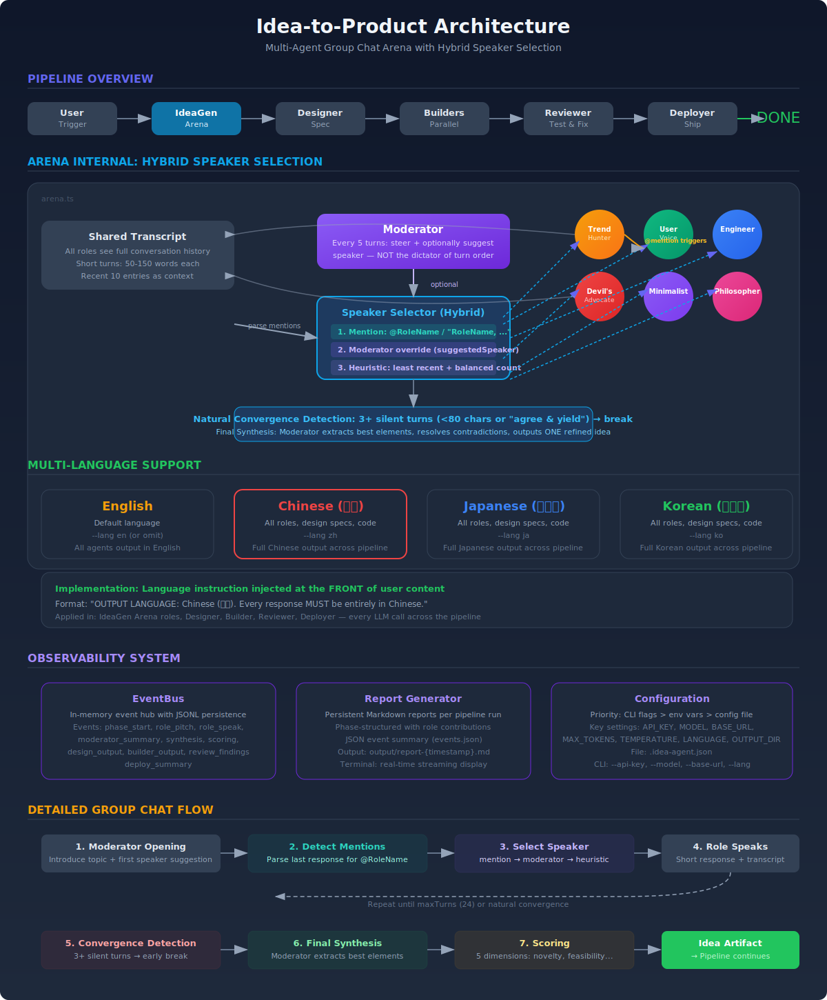

# Idea-to-Product

Autonomous idea-to-product agent system. From brainstorm to shipped product, zero human intervention.

> [中文文档](README_CN.md) | [架构图](docs/architecture.svg) | [中文架构图](docs/architecture-cn.svg)

## How It Works

```
User triggers ("I need a product idea")
         │
    ┌────┴────┐
    ▼         ▼
 IdeaGen Arena  ← 6 roles debate (TrendHunter, UserVoice, Engineer,
    │              DevilAdvocate, Minimalist, Philosopher)
    ▼
   Designer  ← Tech stack, pages, data model, dynamic builder specs
    │
    ▼
 Dynamic Builders  ← Parallel agents based on project needs
    │                 (frontend, backend, database, auth, etc.)
    ▼
 IntegrationAgent  ← Merges all builder outputs
    │
    ▼
  Reviewer  ← Build, test, fix errors (auto-retry up to 3x)
    │
    ▼
  Deployer  ← README, dev server, deployment info
    │
    ▼
  DONE — Complete, runnable product
```

## Architecture



### IdeaGen Arena: Multi-Agent Group Chat

The core innovation is a **hybrid speaker selection mechanism** that makes the Arena feel like a natural group chat, not a round-robin reading session.

```
After each role speaks:
  │
  ├─ Priority 1: Mention detected?  → @RoleName / "RoleName, ..."  → that role speaks
  │
  ├─ Priority 2: Moderator steer?   → every 5 turns, moderator suggests who speaks
  │
  └─ Priority 3: Heuristic          → least recent speaker, balanced count
```

This means:
- If **TrendHunter** says *"Engineer, you're ignoring the market reality..."*, the next turn automatically goes to **Engineer**
- If the moderator senses the discussion is running off track, they can **steer** and suggest a specific role
- If neither applies, the system falls back to **balanced round-robin**

Roles are also instructed to **explicitly name** who they want to respond:
> "Minimalist, your reduction misses the network effect. @UserVoice, what do real users actually need here?"

### Convergence

The discussion naturally converges when:
- **3+ consecutive silent turns**: roles say "I agree" with no new content → early break
- **24 turns max**: soft limit prevents runaway discussions

The moderator then produces a **final synthesis**, extracting the strongest elements from all perspectives and resolving contradictions into one refined product idea.

## Quick Start

```bash
# Install
npm install

# Set API key
export ANTHROPIC_API_KEY=your-key-here

# Run with a prompt
npx tsx src/cli.ts "I want to build something fun"

# Or random brainstorm
npx tsx src/cli.ts
```

## Configuration

Three ways to configure, in priority order: **CLI flags > environment variables > config file > defaults**.

### CLI Flags

```bash
# API key
npx tsx src/cli.ts --api-key sk-ant-xxx "Build a todo app"

# Custom model
npx tsx src/cli.ts --model claude-opus-4-6-20250514 "Build a portfolio"

# Custom API base URL (for proxies, compatible APIs)
npx tsx src/cli.ts --base-url https://your-proxy.com/v1 "Build a landing page"

# All options
npx tsx src/cli.ts \
  --api-key sk-ant-xxx \
  --model claude-sonnet-4-6-20250514 \
  --base-url https://your-proxy.com/v1 \
  --max-tokens 8192 \
  --temperature 0.7 \
  -o ./output \
  -v \
  "Build a SaaS landing page"
```

### Environment Variables

```bash
# API key (required)
export ANTHROPIC_API_KEY=sk-ant-xxx

# Model (default: claude-sonnet-4-6-20250514)
export MODEL=claude-opus-4-6-20250514
# or
export ANTHROPIC_MODEL=claude-opus-4-6-20250514

# Base URL (for proxies / compatible APIs like Azure, OpenRouter, etc.)
export BASE_URL=https://your-proxy.com/v1
# or
export ANTHROPIC_BASE_URL=https://your-proxy.com/v1

# Max tokens (default: 8192)
export MAX_TOKENS=16384

# Temperature (default: 0.7)
export TEMPERATURE=0.9
```

### Config File

Create `.idea-agent.json` in your project directory (or any parent directory):

```json
{
  "apiKey": "sk-ant-xxx",
  "model": "claude-sonnet-4-6-20250514",
  "baseUrl": "",
  "maxTokens": 8192,
  "temperature": 0.7
}
```

Or copy the example: `cp .idea-agent.example.json .idea-agent.json`

### Using Compatible APIs

If you're using a proxy or compatible API (OpenRouter, Azure, etc.), set `--base-url`:

```bash
# OpenRouter
npx tsx src/cli.ts --base-url https://openrouter.ai/api/v1 "Build a blog"

# Local Ollama (if Anthropic-compatible)
npx tsx src/cli.ts --base-url http://localhost:11434 --model local-model "Build a tool"
```

### Language Support

Set the output language for **all pipeline stages**: role discussions, design specs, code comments, reviews, and README.

```bash
# Chinese
npx tsx src/cli.ts --lang zh "Build a todo app"

# Japanese
npx tsx src/cli.ts --lang ja "Build a portfolio"

# Korean
npx tsx src/cli.ts --lang ko "Build a landing page"

# English (default)
npx tsx src/cli.ts --lang en "Build a blog"
```

Or via environment variable:

```bash
export LANGUAGE=zh
```

Supported languages: `en` (default), `zh` / `zh-CN`, `ja`, `ko`. When set to Chinese, every role in the Arena debates in Chinese, the Designer writes specs in Chinese, and all generated docs are in Chinese.

## Pipeline Architecture

| Agent | Role | Parallel? |
|-------|------|-----------|
| **IdeaGen Arena** | 6-role group chat with hybrid speaker selection | Internal parallel |
| **Designer** | Tech architecture & specs | Sequential |
| **Dynamic Builders** | Code generation | Parallel (per spec) |
| **IntegrationAgent** | Merge builder outputs | Sequential |
| **Reviewer** | Build, test, auto-fix | Sequential |
| **Deployer** | Docs, dev server | Sequential |

### Hybrid Speaker Selection Details

The Arena uses a 3-tier speaker selection system:

| Tier | Trigger | Example |
|------|---------|---------|
| **1. Mention** | Role explicitly names another | `"Engineer, you're wrong about..."` → Engineer speaks |
| **2. Moderator** | Every 5 turns, moderator suggests | `"NEXT: UserVoice — we need user validation"` |
| **3. Heuristic** | Fallback: least recent + balanced | Rotates among underrepresented roles |

This creates natural conversation flow: roles can interrupt and respond to each other, while the moderator maintains direction without dictating every turn.

### Dynamic Builder Spawning

The Designer analyzes the project type and decides which builders are needed:

- **SPA** → config + frontend
- **Full-stack app** → config + frontend + backend + database
- **Chrome extension** → config + extension-core + popup-ui + background-script
- **CLI tool** → config + core-logic + command-parser
- **API service** → config + api-server + docs

Each builder runs in parallel, generating its assigned files simultaneously.

## Project Structure

```
src/
├── agents/
│   ├── idea-gen/
│   │   ├── arena.ts      # Multi-agent group chat with hybrid speaker selection
│   │   └── roles.ts      # 6 role definitions (TrendHunter, UserVoice, etc.)
│   ├── designer/
│   │   └── index.ts      # Product design & tech specs
│   ├── builder/
│   │   └── index.ts      # Dynamic parallel builders
│   ├── reviewer/
│   │   └── index.ts      # Build/test/fix loop
│   └── deployer/
│       └── index.ts      # Docs & deployment
├── core/
│   ├── agent.ts          # Base agent class
│   ├── orchestrator.ts   # Pipeline orchestrator
│   └── config.ts         # Configuration resolver (API key, model, language)
├── observability/
│   ├── event-bus.ts      # In-memory event hub with JSONL persistence
│   ├── terminal-formatter.ts  # Real-time terminal streaming display
│   └── report-generator.ts    # Persistent Markdown reports
├── types/
│   └── artifacts.ts      # Type definitions
├── utils/
│   ├── logger.ts         # Structured logging
│   └── fs-helpers.ts     # File operations
└── cli.ts                # CLI entry point
```

## Requirements

- Node.js 20+
- Anthropic API key (or compatible API via `--base-url`)

## License

MIT
