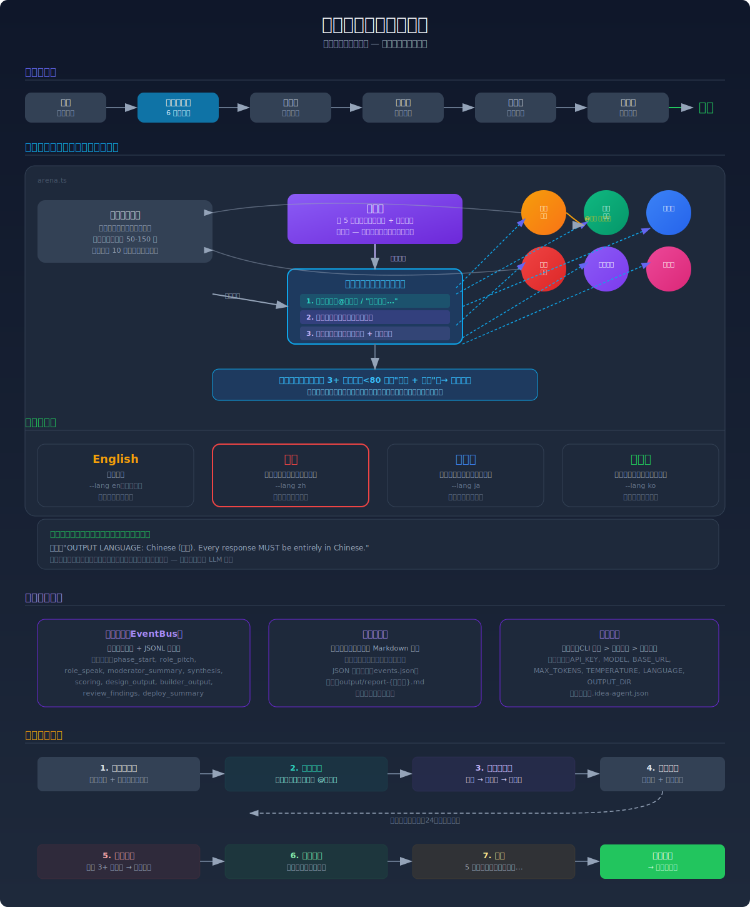

# 创意到产品

自主从想法到产品的智能体系统。从头脑风暴到产品上线，零人工干预。

> [English Documentation](README.md) | [Architecture Diagram](docs/architecture-cn.svg) | [English Architecture](docs/architecture.svg)

## 工作流程

```
用户触发（"我需要一个产品创意"）
         │
    ┌────┴────┐
    ▼         ▼
 创意竞技场  ← 6 角色辩论（趋势猎人、用户之声、工程师、
    │            反方辩手、极简主义者、哲学家）
    ▼
  设计师  ← 技术栈、页面、数据模型、动态构建规格
    │
    ▼
 动态构建器  ← 根据项目需求并行开发
    │            （前端、后端、数据库、认证等）
    ▼
 集成智能体  ← 合并所有构建器产出
    │
    ▼
  审查者  ← 构建、测试、修复错误（自动重试最多 3 次）
    │
    ▼
  部署者  ← README、开发服务器、部署信息
    │
    ▼
  完成 — 完整可运行的产品
```

## 架构



### 创意竞技场：多智能体群聊

核心创新在于**混合发言权选择机制**，让竞技场感觉像自然的群聊，而不是轮流念稿。

```
每个角色发言结束后：
  │
  ├─ 优先级 1：检测到点名？→ @角色名 / "角色名，..."  → 被点名者发言
  │
  ├─ 优先级 2：主持人介入？→ 每 5 轮主持人建议发言者
  │
  └─ 优先级 3：启发式兜底  → 最久未发言者 + 均衡计数
```

这意味着：
- 如果**趋势猎人**说 *"工程师，你忽略了市场现实..."*，下一轮自动轮到**工程师**
- 如果主持人感觉讨论偏离方向，可以**引导方向**并建议特定角色
- 如果都没有，系统回退到**均衡轮转**

角色还被指示**明确点名**想回应的对象：
> "极简主义，你的减法忽略了网络效应。@用户之声，真实用户到底需要什么？"

### 收敛机制

讨论会在以下情况自然收敛：
- **连续 3+ 轮沉默**：角色都说"同意"且无新内容 → 提前结束
- **最多 24 轮**：软限制防止讨论无限进行

主持人随后产出**最终综合**，从所有视角中提取最强元素，化解矛盾，形成一个精炼的产品方案。

## 快速开始

```bash
# 安装
npm install

# 设置 API 密钥
export ANTHROPIC_API_KEY=your-key-here

# 运行（指定想法）
npx tsx src/cli.ts "我想做一个有趣的东西"

# 或随机头脑风暴
npx tsx src/cli.ts
```

## 配置

三种配置方式，优先级顺序：**CLI 参数 > 环境变量 > 配置文件 > 默认值**。

### CLI 参数

```bash
# API 密钥
npx tsx src/cli.ts --api-key sk-ant-xxx "做一个待办应用"

# 自定义模型
npx tsx src/cli.ts --model claude-opus-4-6-20250514 "做一个作品集"

# 自定义 API 基础 URL（代理、兼容 API）
npx tsx src/cli.ts --base-url https://your-proxy.com/v1 "做一个落地页"

# 所有选项
npx tsx src/cli.ts \
  --api-key sk-ant-xxx \
  --model claude-sonnet-4-6-20250514 \
  --base-url https://your-proxy.com/v1 \
  --max-tokens 8192 \
  --temperature 0.7 \
  --lang zh \
  -o ./output \
  -v \
  "做一个 SaaS 落地页"
```

### 环境变量

```bash
# API 密钥（必需）
export ANTHROPIC_API_KEY=sk-ant-xxx

# 模型（默认：claude-sonnet-4-6-20250514）
export MODEL=claude-opus-4-6-20250514
# 或
export ANTHROPIC_MODEL=claude-opus-4-6-20250514

# 基础 URL（代理 / 兼容 API，如 Azure、OpenRouter 等）
export BASE_URL=https://your-proxy.com/v1
# 或
export ANTHROPIC_BASE_URL=https://your-proxy.com/v1

# 最大 token 数（默认：8192）
export MAX_TOKENS=16384

# 温度（默认：0.7）
export TEMPERATURE=0.9

# 语言（默认：en）
export LANGUAGE=zh
```

### 配置文件

在项目目录（或任何父目录）创建 `.idea-agent.json`：

```json
{
  "apiKey": "sk-ant-xxx",
  "model": "claude-sonnet-4-6-20250514",
  "baseUrl": "",
  "maxTokens": 8192,
  "temperature": 0.7,
  "language": "zh"
}
```

或复制示例：`cp .idea-agent.example.json .idea-agent.json`

### 使用兼容的 API

如果使用代理或兼容 API（OpenRouter、Azure 等），设置 `--base-url`：

```bash
# OpenRouter
npx tsx src/cli.ts --base-url https://openrouter.ai/api/v1 "做一个博客"

# 本地 Ollama（如果兼容 Anthropic 接口）
npx tsx src/cli.ts --base-url http://localhost:11434 --model local-model "做一个工具"
```

### 语言支持

设置**全流水线阶段**的输出语言：角色讨论、设计规格、代码注释、审查、README。

```bash
# 中文
npx tsx src/cli.ts --lang zh "做一个待办应用"

# 日文
npx tsx src/cli.ts --lang ja "做一个作品集"

# 韩文
npx tsx src/cli.ts --lang ko "做一个落地页"

# 英文（默认）
npx tsx src/cli.ts --lang en "做一个博客"
```

支持的语言：`en`（默认）、`zh` / `zh-CN`、`ja`、`ko`。设置为中文时，竞技场中所有角色用中文辩论，设计师用中文写规格，所有生成的文档都是中文。

**终端日志也已国际化** — 配置显示、阶段标题、状态消息、进度日志都会使用所选语言显示。

### Web UI

启动 Web UI 实时查看流水线运行过程：

```bash
# 启动 Web UI
npx tsx src/cli.ts --web "做一个待办应用"

# 自定义端口（默认：8080）
npx tsx src/cli.ts --web --port 3000 "做一个博客"

# 中文输出 + Web UI
npx tsx src/cli.ts --web --lang zh "做一个待办应用"
```

Web UI 显示：
- 实时竞技场辩论流
- 阶段进度指示
- 事件时间线
- 角色状态可视化
- 停止按钮可中断执行

## 流水线架构

| 智能体 | 职责 | 并行？ |
|--------|------|--------|
| **创意竞技场** | 6 角色群聊，混合发言权选择 | 内部并行 |
| **设计师** | 技术架构与规格 | 顺序 |
| **动态构建器** | 代码生成 | 并行（按规格） |
| **集成智能体** | 合并构建器产出 | 顺序 |
| **审查者** | 构建、测试、自动修复 | 顺序 |
| **部署者** | 文档、开发服务器 | 顺序 |

### 混合发言权选择详情

竞技场使用三级发言权选择系统：

| 层级 | 触发条件 | 示例 |
|------|---------|------|
| **1. 点名** | 角色明确点名另一个 | `"工程师，你错了..."` → 工程师发言 |
| **2. 主持人** | 每 5 轮，主持人建议 | `"下一个：用户之声 — 需要用户验证"` |
| **3. 启发式** | 兜底：最久未发言 + 均衡 | 在发言较少的角色间轮转 |

这创造了自然的对话流程：角色可以打断和回应彼此，同时主持人维持方向而不独裁每一轮。

### 动态构建器生成

设计师根据项目类型决定需要哪些构建器：

- **单页应用** → 配置 + 前端
- **全栈应用** → 配置 + 前端 + 后端 + 数据库
- **Chrome 扩展** → 配置 + 扩展核心 + 弹窗界面 + 后台脚本
- **CLI 工具** → 配置 + 核心逻辑 + 命令解析器
- **API 服务** → 配置 + API 服务器 + 文档

每个构建器并行运行，同时生成其分配的文件。

## 项目结构

```
src/
├── agents/
│   ├── idea-gen/
│   │   ├── arena.ts      # 多智能体群聊，混合发言权选择
│   │   └── roles.ts      # 6 个角色定义
│   ├── designer/
│   │   └── index.ts      # 产品设计与技术规格
│   ├── builder/
│   │   └── index.ts      # 动态并行构建器
│   ├── reviewer/
│   │   └── index.ts      # 构建/测试/修复循环
│   └── deployer/
│       └── index.ts      # 文档与部署
├── core/
│   ├── agent.ts          # 基础智能体类
│   ├── orchestrator.ts   # 流水线编排器
│   └── config.ts         # 配置解析器（API 密钥、模型、语言）
├── i18n/
│   ├── index.ts          # 翻译工具（t() 函数）
│   ├── context.ts        # 全局语言上下文
│   └── locales/          # 翻译文件（en, zh, ja, ko）
├── observability/
│   ├── event-bus.ts      # 内存事件中心 + JSONL 持久化
│   ├── terminal-formatter.ts  # 实时终端流式展示
│   └── report-generator.ts    # 持久化 Markdown 报告
├── web/
│   ├── server/           # WebSocket 服务端 + 事件桥接
│   └── client/           # React 前端（Vite + Tailwind）
├── types/
│   └── artifacts.ts      # 类型定义
├── utils/
│   ├── logger.ts         # 结构化日志
│   └── fs-helpers.ts     # 文件操作
└── cli.ts                # CLI 入口点
```

## 要求

- Node.js 20+
- Anthropic API 密钥（或通过 `--base-url` 使用兼容 API）

## 许可证

MIT
